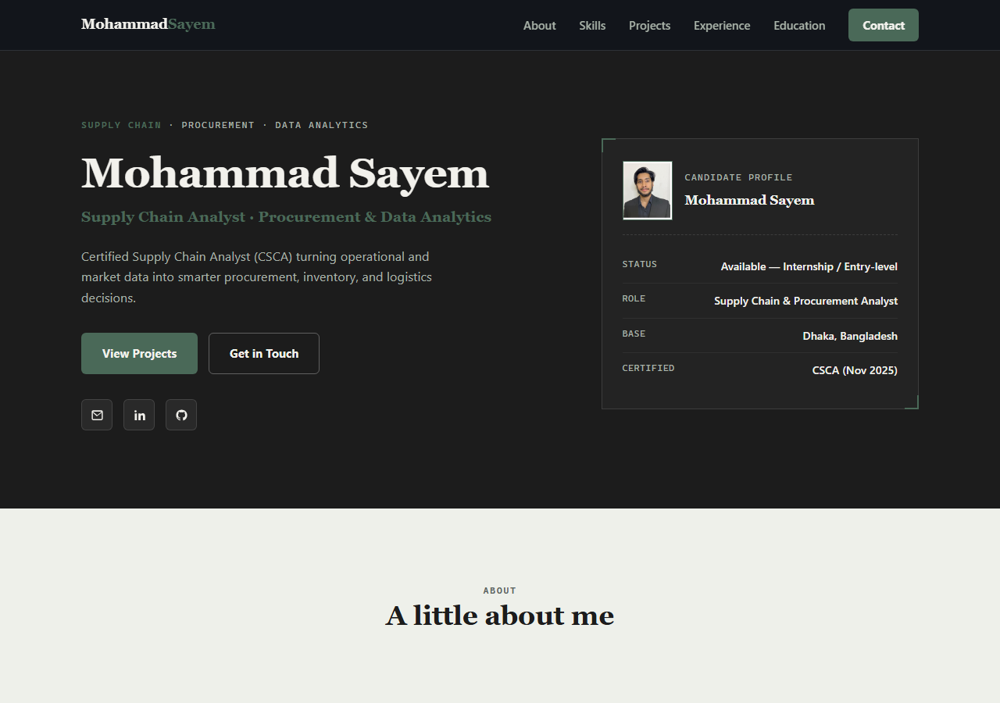
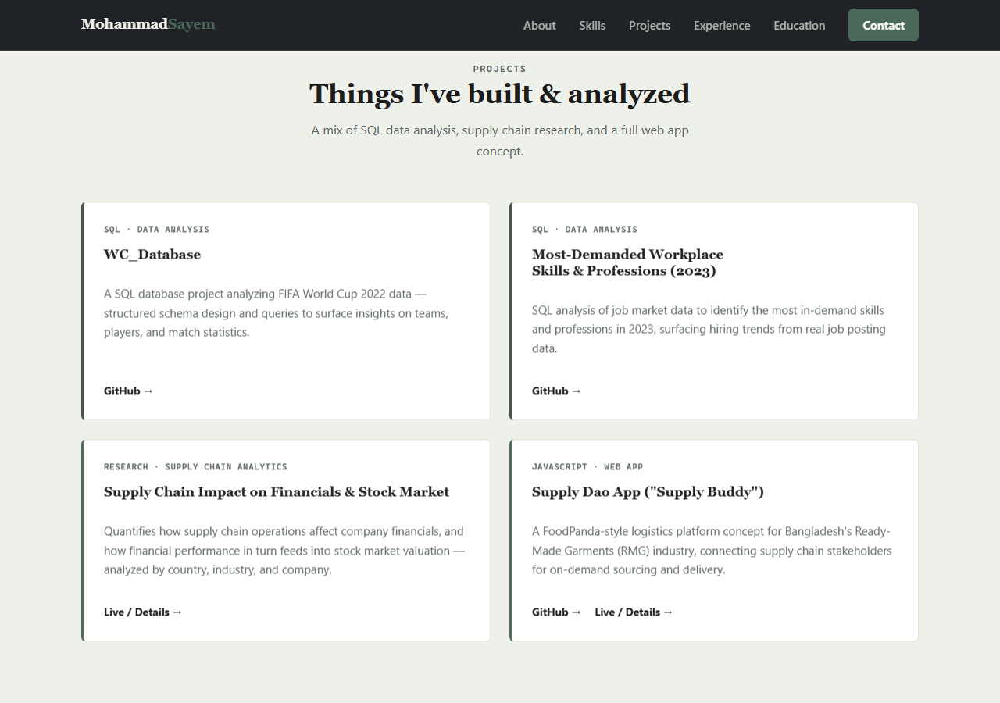
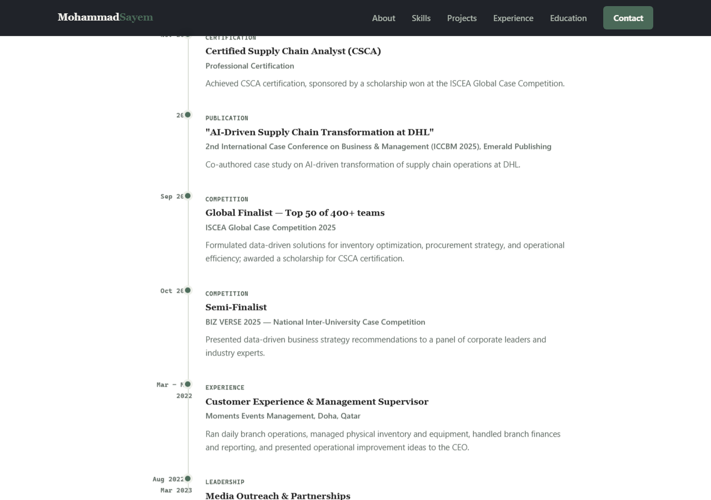

# Mohammad Sayem — Portfolio Website

🔗 **Live site:** https://mohammedsayemqazi-byte.github.io/

This is my personal portfolio website, built to showcase my background in Supply Chain Management and data analytics (SQL, Excel, Power BI) while I look for internship and entry-level opportunities.

I'm not a coder — I built this by describing what I wanted, in plain English, to an AI assistant (Claude). This README explains, in simple terms, how that process worked, in case it's useful to anyone else thinking about doing the same thing.

---

## What the site looks like

**Homepage — introduction and quick profile summary**

**Projects section**

**Experience & Achievements timeline**

---

## How this website was built, step by step

1. **I described what I needed.** I told Claude I wanted a professional portfolio website, that I'm not technical, and asked it to ask me questions rather than assume anything.

2. **I answered questions about myself.** What job I'm looking for, my skills, my background, and how I'd want to update the site later on. I also shared my CV so all the real details (education, certifications, projects, competitions) could be used accurately.

3. **Claude built a first draft** as a single website file, and showed it to me as a clickable preview before changing anything for real, so I could react to it before it was final.

4. **We went back and forth on the look.** I asked for a navy blue and gold color scheme, then changed my mind and shared a green-and-black color palette image I liked better — Claude matched the site's colors to it and made the fonts feel more professional.

5. **I added my profile photo.** This took a couple of tries since photos shared in chat aren't automatically saved as files — I ended up saving the photo myself into the project folder, and Claude wired it into the design.

6. **Claude added a built-in editor**, right on the website itself, so I can update my own text, add new projects, certifications, or experience entries later — without touching any code. There's a small pencil icon on the site that only I can see (it's hidden from visitors) that opens this editor.

7. **Claude published the site for free** using GitHub Pages — a free hosting service from GitHub (the same platform where my SQL and coding projects already live). That's what gives the site its public web address.

8. **Screenshots and this README were generated** to document the whole process and give anyone visiting the code a quick visual preview of the site.

---

## How I can update this site myself later

- Open `index.html` on my computer (double-click it) or visit the live site and add `?edit=true` to the end of the URL.
- Click the small pencil (✏️) button in the bottom-right corner.
- Edit any text, or add/remove projects, certifications, education, or timeline entries. Click **"Apply Changes"** to preview instantly.
- Click **"Download Updated File"** to save the changes as a new `index.html`.
- Replace the old file with the new one in this project folder, then let Claude know so the update can be pushed to the live site.

## What's technically inside (for the curious)

- The whole site is a single `index.html` file — no build tools, frameworks, or installations required.
- Plain HTML, CSS, and JavaScript, so it can be opened directly in any browser.
- Hosted for free on **GitHub Pages**, directly from this repository.
